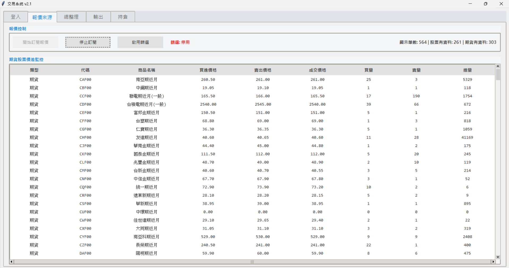
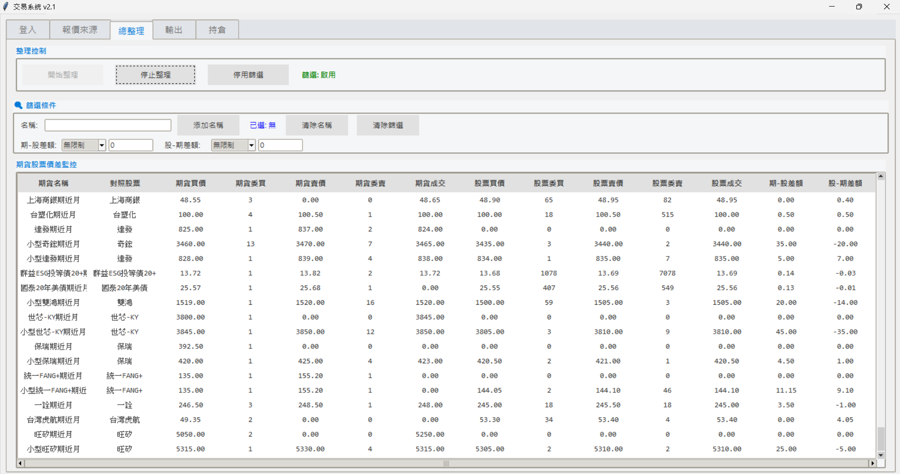
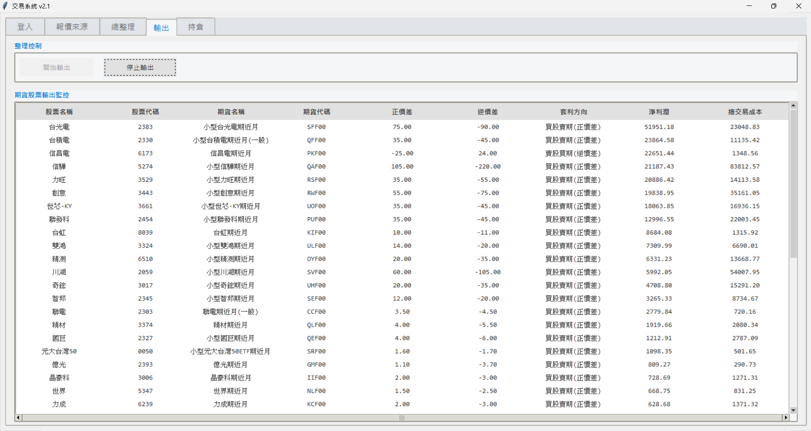

# 即時報價與期現貨價差監控系統


## 專案介紹

QuotationSystem 是一套 Windows 桌面型即時報價與期現貨價差監控工具。專案以 Python 與 Tkinter 開發，透過群益證券 Capital API 的 COM 元件取得行情、帳戶與持倉資料，並將期貨與現貨配對後計算價差、交易成本與預估淨利，協助使用者觀察可能的套利機會。

> 本專案僅供報價監控與研究用途，不構成投資建議，也不保證任何交易結果。

## 主要功能

- **帳號登入與報價連線**：透過 Capital API 登入、建立報價連線並取得帳戶資訊。
- **即時行情訂閱**：訂閱股票與期貨商品，顯示買賣價、收盤價、委買委賣量與成交量，並提供名稱、商品類型、價格及成交量篩選。
- **期現貨價差分析**：依預先定義的期貨／股票配對，即時計算正價差、逆價差、手續費、交易稅與預估淨利。
- **套利機會排序**：篩選符合條件的價差組合，呈現套利方向、淨利與總交易成本，並依淨利排序。
- **K 線圖**：雙擊報價表的商品可請求 1 分鐘 K 線資料，並以深色主題燭台圖呈現。
- **持倉查詢**：讀取證券與期貨帳戶的庫存／未平倉資料並分表展示。
- **系統日誌**：以執行緒安全的訊息佇列更新 UI 日誌，支援清除與匯出文字檔。

## 使用技術

| 類別 | 技術 |
| --- | --- |
| 語言 | Python 3 |
| 桌面介面 | Tkinter、ttk |
| 資料處理 | pandas |
| 圖表 | matplotlib、mplfinance |
| API 整合 | Capital API、COM、`comtypes` |
| 打包 | PyInstaller |
| 平台 | Windows、64 位元 DLL |

## 開發環境

- Windows 10 / 11
- Python 3.x
- 與 Python 位元數相容的 Capital API／SKCOM 元件與 DLL
- 可登入 Capital API 的有效帳號；若要查詢持倉，帳號須具備相應權限與憑證
- pip（用於安裝 Python 相依套件）

## 專案結構

```text
QuotationSystem/
├── main.py                    # 應用程式入口與 Tkinter 分頁初始化
├── build.py                   # PyInstaller 打包設定
├── requirements.txt           # Python 相依套件
├── data/                      # 商品清單與期現貨配對資料
│   ├── StockList.txt
│   ├── FutureList.txt
│   └── Compare_Map.txt
├── libs/                      # Capital API 相關 64 位元 DLL
├── Module/
│   ├── sk_api.py              # Capital API COM 封裝與事件處理
│   ├── data_manager.py        # 資料載入、行情快取與資料分發
│   ├── models.py              # 股票、期貨與價差資料模型
│   ├── constants.py           # 交易成本相關常數
│   ├── logger.py              # 執行緒安全日誌工具
│   ├── SKCOM.dll              # COM 型別庫
│   └── ui/
│       ├── login.py           # 登入、連線與日誌頁
│       ├── quote.py           # 即時報價頁
│       ├── information.py     # 期現貨價差總覽頁
│       ├── output.py          # 套利機會輸出頁
│       ├── position_page.py   # 證券／期貨持倉頁
│       ├── chart_window.py    # K 線視窗
│       └── dialogs.py         # 公告對話框
└── references/                # 原始範例程式參考
```

## 資料設計

本專案不使用傳統資料庫。啟動時會讀取 `data/` 中的文字檔，並在記憶體中維護即時行情與分析資料。

| 資料來源／模型 | 用途 |
| --- | --- |
| `StockList.txt` | 股票名稱與商品代碼對照。 |
| `FutureList.txt` | 期貨商品代碼與名稱對照。 |
| `Compare_Map.txt` | 期貨與對應股票的配對規則，是價差計算的基礎。 |
| `StockInfo`／`FutureInfo` | 保存單一商品的即時買賣價、成交量與行情欄位。 |
| `PriceSpreadInfo` | 組合一組期貨與股票，計算價差、成本、預估淨利與套利方向。 |
| `DataManager` | 集中管理商品、價差配對、K 線快取、帳戶與持倉回呼。 |

## 安裝與執行方式

1. 安裝可用的 Python 3 與群益 Capital API 元件，並確認 API DLL 與 Python 的位元數一致。
2. 進入專案目錄後建立虛擬環境並安裝相依套件：

   ```powershell
   py -m venv .venv
   .\.venv\Scripts\Activate.ps1
   pip install -r requirements.txt
   ```

3. 確認 `Module/SKCOM.dll` 與 `libs/` 中的相關 DLL 保留在原始位置。
4. 啟動程式：

   ```powershell
   python main.py
   ```

5. 在「登入」頁輸入 Capital API 帳號與密碼，登入後建立報價連線，再前往其他頁面訂閱行情、查看價差或查詢持倉。

### 打包成執行檔

執行下列指令可透過 PyInstaller 產生 Windows 應用程式：

```powershell
python build.py
```

打包結果會輸出至 `dist/CapitalTester/`。部署時請一併保留程式所需的 DLL 與資料檔。

### 注意事項

- Capital API 的安裝、帳號權限與 API 使用條件請依群益證券提供的官方文件為準。
- 勾選「記住帳號密碼」會在本機建立 `login_config.json`；該檔案已列入 `.gitignore`，請勿上傳或分享。
- API 回傳資料與網路連線可能影響畫面更新與報價結果，使用前請自行確認資料正確性。

## 專案畫面

### 即時報價

「報價來源」頁會訂閱並呈現股票與期貨的即時買賣價、成交價、委買委賣量及總量。



### 期現貨價差總整理

「總整理」頁將期貨與對應股票配對，提供名稱與價差條件篩選，方便監控正價差與逆價差。



### 套利機會輸出

「輸出」頁依預估淨利排序，呈現股票／期貨代碼、價差、套利方向與總交易成本。


